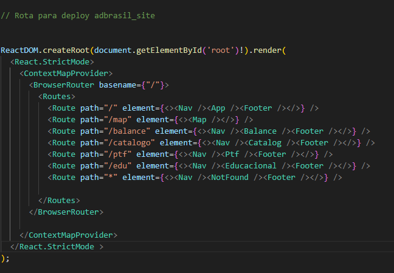

# RELATÓRIO DE ATIVIDADES DO BOLSISTA FAPED

Modalidade: BOLSA DE ESTÍMULO À INOVAÇÃO – Modalidade: F Profissional de nível médio com, no mínimo, 3(três) anos de experiência comprovada em atividades de pesquisa, desenvolvimento ou inovação, ou na implantação de processos de produção e atividades gerenciais. Período de avaliação: 01/02/2023 a 29/02/2024
Instituição: Empresa Brasileira de Pesquisa Agropecuária – Embrapa (Embrapa Solos)
Coordenador: Evaldo de Paiva Lima CPF: 032.031.684-05
Bolsista: Estevão Lucas Ramos da Silva
CPF: 107.067.814-73
E-mail: hurryblank@gmail.com
Celular: (81) 99969-0966

> Status: Concluido 💡

# Descrição
- Projeto desenvolvido por [Estevão Lucas](https://github.com/luccve) vinculado ao projeto 1134 - FAPED/CNPTIA/BCB_ZARC/Solos UEP-
20800220109-7. Para o desenvolvimento da plataforma ADBrasil que forneça informações de água disponível em todo o Brasil em função das coordendas, catálogo de solos, elaboração de mapas e equações de predição.

- Este relatório também servirá como documentação do aplicativo ADBrasil, e do site ADBrasil, portanto destaco desde a sua concepção até a logica empregada nas atividades realizadas.

- Para o desenvolvimento mobile a linguagem utilizada foi o typescript junto com dois frameworks o react native e o expo. Para o desenvolvimento do site foi utilizando typescript e react.

- Os versionamentos do projeto estão disponível no package.json de cada projeto.

- Além dessas aplicações, houve a criação de protocolos que foram anexados neste presente relatório.

# Preview


# Primeiros Passos

## Guia Windows/Linux/macOS Site

```bash
git clone https://github.com/luccve/site_ADBrasil.git

cd site_ADBrasil

npm install

```

### Iniciando o cliente na sua máquina site

```bash
npm run dev
```

### Scripts Build and deploy

- Foi elaborado dois scripts _deploy.bat_ e _deploy.sh_ na pasta raiz do projeto que faz o deploy já em produção do site.
- **Obs.:** o arquivo  ***main.tsx*** define as rotas da aplicação e a base url. Por padrão ao dar o deploy é preciso definir a base url para ***adbrasil_site*** em vez de somente a **/**.

- Ex. Ambiente de desenvolvimento: 
- Ex. Ambiente de producao: 


- Scripts para automatização
```bash
#no windows
 .\deploy.bat

#no mac/linux
 npm run deploy

#ou
 source ./deploy.sh
```


## Guia Windows/Linux/macOS Aplicativo

### Primeiros Passos
- Para realização das instalações do ambiente para manutenção do código e do aplicativo foi definida em dois sistemas operacionais todas as etapas de formar a garantir toda execução do projeto sem interferência.
- O importante é a instalação do versionamento adequado do ambiente. E sobretudo, isolamento das aplicações.
É imprescindível que o hardware tenha o mínimo de 8 gigas de RAM. E a virtualização ligada, dependendo do seu processador será necessário acessar a bios da sua placa mãe.
- São necessários em qualquer sistema operacional instalação nesta ordem para evitar conflitos:
  
    - O java jdk 11/17 versão zulu;
    - O nodejs versão 16 ou superior LTS;
    - O Android Studio;
    - O GIT versão 2.40.1;
    - TOKEN de acesso ao repositório (consultar líder do projeto);
    - Visual studio code.
- clone o repositório do github. Atualmente o link é -> https://github.com/luccve/ADBrasil.git
    - Com o seguinte comando irá ser clonado o repositório no diretório escolhido:
        ~~~bash
        git clone https://github.com/luccve/ADBrasil
        ~~~
    - Depois da instalação adequado de todo ambiente para executar o código é preciso instalar os pacotes de bibliotecas e dependências do package.json. Abra a pasta do projeto com o terminal ou sua IDE de desenvolvimento (Visual Studio Code) e execute o seguinte comando:
        ~~~bash
        npm install
        npx expo start
        ~~~
    - A etapa acima é demorada e é preciso de privilegio administrativo a depender do nível de restrição do sistema operacional. Em seguida é somente escolher o emulador a sua escolha. O expo permite utilizar seu smartphone pessoal excluindo a necessidade de se instalar o android studio.


### Windows
No ambiente windows é preciso se seu processador for intel a ativação do recurso HIPERV.
- Ativar ou desativar recursos do windows consultar tutorial da internet para melhores esclarecimentos.
- Variáveis de ambiente, para a execução de programas do windows de forma integrada é preciso na hora de instalação dos programas necessários para configurar o ambiente a marcação de adicionar ao PATH/ADD TO PATH. Caso aja algum problema será preciso criar de forma manual. Consulte tutoriais paras melhores esclarecimentos.

### Mac OS Ventura
- Etapa inicial:
  - Instalação do Homebrew;
        Consulte o site -> https://brew.sh/
~~~bash
/bin/bash -c "$(curl -fsSL https://raw.githubusercontent.com/Homebrew/install/HEAD/install.sh)"
~~~
  - Comandos a executar depois da instalação:
    ~~~bash
    brew install git
    brew install node@18
    brew install --cask visual-studio-code
    brew install openjdk@17
    brew install --cask android-studio
    ~~~

No ambiente unix além das instalações padrões via linha de comando utilizando o **homebrew** é preciso a instalação do XCODE na loja da apple store.

Pronto agora é só seguir a instalação padrão no tutorial.


# Stack Site
Plataforma desenvolvida no Node.js LTS.
## React + TypeScript + Vite

This template provides a minimal setup to get React working in Vite with HMR and some ESLint rules.

Currently, two official plugins are available:

- [@vitejs/plugin-react](https://github.com/vitejs/vite-plugin-react/blob/main/packages/plugin-react/README.md) uses [Babel](https://babeljs.io/) for Fast Refresh
- [@vitejs/plugin-react-swc](https://github.com/vitejs/vite-plugin-react-swc) uses [SWC](https://swc.rs/) for Fast Refresh


# Estrutura do projeto do site

O projeto do site conta com os seguintes diretórios. 
~~~
.
├── .env
├── .eslintrc.cjs
├── .gitignore
├── deploy.bat
├── deploy.sh
├── index.html
├── package-lock.json
├── postcss.config.js
├── tailwind.config.js
├── tsconfig.json
├── tsconfig.node.json
├── vite.config.ts
├── public
├── README.md
├── src
│   ├── @types
│   ├── assets
│   ├── components
│   ├── contexts
│   ├── database
│   ├── pages
│   ├── ptfFunctions
│   ├── services
│   ├── themes
│   ├── App.css
│   ├── App.tsx
│   ├── index.css
│   ├── main.tsx
│   ├── vite-env.d.ts
~~~

## A organização:
  
- App.tsx: Ponto de entrada principal do aplicativo.
- README.md: Documentação do projeto.
- node_modules: Pasta que contém as dependências do projeto.
- package.json: Arquivo de configuração e informações do projeto.
- vite.config.ts: Arquivo de configuração do Vite.
- src: Pasta principal do código-fonte.
  - @types: Definições de tipo personalizadas.
  - assets/: Recursos estáticos, como JSON, imagens e ícones.
  - contexts: Contextos do React para compartilhamento de dados.
  - PtfFunctions: Funções relacionadas ao Ptf.
  - main.tsx: Componente principal do site.
  - components: Componentes reutilizáveis.
  - database: Arquivos relacionados ao informações de catálogo.
  - routes: Definição das rotas de navegação.
  - pages: Telas principais do site.
  - services: Serviços e utilitários do aplicativo.
  - theme: Estilos e configurações de aparência.
- tsconfig.json: Configuração do TypeScript.


# Estrutura do projeto mobile
O projeto conta com os seguintes diretórios. 
~~~
.
├── App.tsx
├── README.md
├── android
├── app.json
├── assets
│   ├── catalog2.json
│   ├── embrapa.json
│   ├── icons
│   ├── image
│   ├── models.json
│   └── zn.json
├── babel.config.js
├── config.ts
├── declarations.d.ts
├── documentation
│   ├── diagram
│   └── mobile_views
├── eas.json
├── index.js
├── ios
├── metro.config.js
├── node_modules
├── package-lock.json
├── package.json
├── src
│   ├── @types
│   ├── Contexts
│   ├── PtfFunctions
│   ├── components
│   ├── database
│   ├── routes
│   ├── screens
│   ├── services
│   └── theme
└── tsconfig.json
~~~
## A estrutura do projeto segue  a seguinte organização:
  
- App.tsx: Ponto de entrada principal do aplicativo.
- README.md: Documentação do projeto.
- android/: Pasta específica para o desenvolvimento Android.
- ios/: Pasta específica para o desenvolvimento iOS.
- app.json: Configurações e metadados do aplicativo.
- assets/: Recursos estáticos, como JSON, imagens e ícones.
- babel.config.js: Configuração do Babel.
- config.ts: Configurações específicas do aplicativo.
- declarations.d.ts: Arquivo de declaração de tipos personalizados.
- documentation/: Pasta contendo documentação adicional.
- eas.json: Configuração do EAS CLI.
- index.js: Ponto de entrada do código JavaScript/TypeScript.
- metro.config.js: Configuração do Metro Bundler.
- node_modules/: Pasta que contém as dependências do projeto.
- package.json: Arquivo de configuração e informações do projeto.
- src/: Pasta principal do código-fonte.
  - @types/: Definições de tipo personalizadas.
  - Contexts/: Contextos do React para compartilhamento de dados.
  - PtfFunctions/: Funções relacionadas ao Ptf.
  - components/: Componentes reutilizáveis.
  - database/: Arquivos relacionados ao banco de dados SQLite.
  - routes/: Definição das rotas de navegação.
  - screens/: Telas do aplicativo.
  - services/: Serviços e utilitários do aplicativo.
  - theme/: Estilos e configurações de aparência.
- tsconfig.json: Configuração do TypeScript.

# Componentes Site

O desenvolvimento da aplicação é funcional e com separação de responsabilidades (Separation of concerns).


## Btn
Ao todo foi desenvolvido 4 botoes. Que segue o padrao com as cores do site.
### btnLink

- O componente BtnLink é uma abstração para um botão de link personalizado em aplicações React. Ele permite que o usuário clique no botão e seja redirecionado para uma rota específica. Aqui estão os principais pontos sobre esse componente:

#### Propriedades

<div align='center'>

| Propriedade  | Tipo            | Descrição                                               |
|--------------|-----------------|---------------------------------------------------------|
| title     | string      | Titulo do botão.|
| path          | string         | Caminho da url do botão.                          |
| children         | JSXElement         | Pode anexar uma imagem ao botão passando como filho.                          |
          
</div>

### BtnRegular

- O componente BtnRegular é uma abstração para um botão de link personalizado em aplicações React. Ele permite que o usuário clique no botão e seja redirecionado para uma rota específica. Aqui estão os principais pontos sobre esse componente:

#### Propriedades

<div align='center'>

| Propriedade  | Tipo            | Descrição                                               |
|--------------|-----------------|---------------------------------------------------------|
| title     | string      | Titulo do botão.|
| path          | string         | Caminho da url do botão.                          |
| children         | JSXElement         | Pode anexar uma imagem ao botão passando como filho.                          |
          
</div>

### btnSave

### BtnToggleArrow

## Card

## Carrousel

## Chart

## Footer

## formPTF

## GeoJSONMap

## GetCoordinates

## getLegendsMaps

## getPosition

## handlePositionMap

## icon

## input

## loading

## mapEvents

## miniMap

## modal

## nav

## navMap

## notFound

## opacitySliderMap

## resultadoPTF

## ScrollToHashElemtn

## searchClip

## TilerLayersMapControl

## triangleTexture

## WMSTilerLayersControl


# Componentes Mobile
Houve a criação de 11 componentes dispostos nos diretórios abaixo:
~~~
.
├── src
│   ├── components
│   │   ├── Areabtn
│   │   ├── Card
│   │   ├── CarrouselRegiao
│   │   ├── FormPTF
│   │   ├── Information
│   │   ├── Linking
│   │   ├── Load
│   │   ├── Map
│   │   ├── Modal
│   │   ├── ResultadoPTF
│   │   ├── Tabs
│   │   └── svg

~~~
Para acessar os tipos com mais detalhes [Clique aqui!](#tipagem-dos-dados).
## Descrição dos componentes
>Sua estilização está em um arquivo separado utilizando a biblioteca styles components. Exemplo: **src/components/Areabtn/styles.tsx**
### Areabtn
  
-  O componente Areabtn é responsável por renderizar um conjunto de botões que executam funcionalidades específicas no aplicativo.
  Suas funcionalidades dependem da variável **map** que determinar quais funcionalidades serão exibidas, portanto a exibição deste componente pode variar. Ele recebe as seguintes propriedades:


#### Propriedades

<div align='center'>

| Propriedade  | Tipo            | Descrição                                               |
|--------------|-----------------|---------------------------------------------------------|
| onSelect     | () => void      | Função de callback para ser executada quando selecionado.|
| map          | boolean         | Indica se o mapa está ativado.                          |
| menu         | boolean         | Indica se o menu está ativado.                          |
| satellite?   | () => void      | Função de callback para ativar a visualização de satélite (opcional). |
| share?       | () => void      | Função de callback para compartilhar (opcional).         |
| clear?       | () => void      | Função de callback para limpar (opcional).               |
| search?      | () => void      | Função de callback para pesquisar (opcional).            |
</div>


### Card

Componente que insere um layout da janela **Publicações e mapas**. Os parâmetros que recebe são:
    
~~~tsx

  export default function Card({ url, img, autoria, title }: CardProps)
~~~

>Caminho do código fonte: **src/components/Card/index.tsx**

#### Propriedades

<div align='center'>

| Propriedade | Tipo     | Descrição                      |
|-------------|----------|--------------------------------|
| url         | string   | A URL associada ao card.       |
| img         | string   | O caminho da imagem do logo.   |
| autoria     | string   | A descrição do autor do card.  |
| title       | string   | O título do card.              |
</div>

### CarrouselRegion

O componente `CarrouselRegion` é responsável por exibir um carrossel de regiões selecionáveis. Ele recebe 3 parâmetros, que permite selecionar uma região e executa uma função de callback quando uma região é selecionada. Ele possui as seguintes propriedades:

#### Propriedades

| Propriedade | Tipo     | Descrição                              |
|-------------|----------|----------------------------------------|
| Array       | array    | Um array de objetos contendo as regiões disponíveis. Cada objeto possui uma propriedade `label` que representa o nome da região.  |
| onSelect    | function | Uma função de callback que é executada quando uma região é selecionada. A função recebe o índice da região selecionada como argumento. |
| title       | string   | O título exibido acima do carrossel de regiões (opcional). |

### FormPTF

O componente `FormPTF` é um componente React que representa um formulário para inserir dados relacionados às Funções *Pedotransferência* (PTF). Ele inclui campos de entrada para vários parâmetros, como teor de areia, teor de silte, teor de argila, densidade, matéria orgânica, pH e umidade equivalente. Ele também oferece funcionalidade para realizar cálculos com base nos dados inseridos e exibir os resultados. As entradas estão de forma dinâmica organizada em abas, de acordo com o tipo de formulário PTF selecionado pelo usuário. 
>O caminho do código fonte: **src/components/FormPTF/index.tsx**

#### Propriedades
Este componente aceita as seguintes propriedades:

- `type`: Especifica o tipo de formulário PTF. Os valores possíveis são "AVC" (Avançado), "INT" (Intermediário) e "SIM" (Simples).
- `tab`: Especifica o índice da aba ativa. Os valores possíveis são 0, 1 e 2.

##### Estados

O componente mantém os seguintes estados:

- `contador`: Armazena um valor de contador.
- `modalAlert`: Controla a visibilidade do modal de alerta.
- `titleAlert`: Armazena o título do modal de alerta.
- `messageAlert`: Armazena a mensagem do modal de alerta.
- `areia`: Armazena o valor do campo de entrada de teor de areia.
- `areiaFina`: Armazena o valor do campo de entrada de teor de areia fina.
- `areiaGrossa`: Armazena o valor do campo de entrada de teor de areia grossa.
- `silte`: Armazena o valor do campo de entrada de teor de silte.
- `argila`: Armazena o valor do campo de entrada de teor de argila.
- `densidade`: Armazena o valor do campo de entrada de densidade.
- `materiaOrganica`: Armazena o valor do campo de entrada de matéria orgânica.
- `pH`: Armazena o valor do campo de entrada de pH.
- `umidadeEquivalente`: Armazena o valor do campo de entrada de umidade equivalente.


### Information
Não é um componente funcional, e sim funções que são chamadas em outros componentes. Para exibir informações textuais na tela, como o nome do aplicativo, a descrição do aplicativo, etc. O motivo para não ser funcional é que o texto é estático e não precisa de um estado para ser alterado e garantir que a alteração esteja somente em um único lugar do código.
>O caminho do código fonte: **src/components/Information/index.tsx**


### Linking

O componente `Link` é uma função assíncrona responsável por lidar com links e redirecionar o usuário para URLs externas no aplicativo React Native.
>O caminho do código fonte: **src/components/Linking/index.tsx**
#### Propriedades
O componente recebe os seguintes parâmetros:

<div align="center">

| Propriedade | Tipo     | Descrição                |
|-------------|----------|-------------------------|
| `props`     | `string` | URL para redirecionamento |

</div>


### Modais
Existem dois tipos de Modais o **ModalAlert** e o **ModalCard**. O primeiro é um modal de alerta que é chamado quando o usuário tenta inserir dados inválidos no formulário PTF ou operações inválidas. O segundo é um modal que exibe informações textuais sobre o aplicativo.
Todos são derivados do componente Modal do React Native.
>O caminho do código fonte: **src/components/Modal/**
#### ModalAlert


O componente `ModalAlert` é um componente de modal utilizado para exibir um alerta na tela. Ele recebe um título opcional, uma mensagem, um valor booleano para controlar a visibilidade do modal e uma função `onClose` para fechar o modal.

##### Propriedades

| Propriedade | Tipo                            | Descrição                                                  |
| ----------- | ------------------------------- | ---------------------------------------------------------- |
| title       | string                          | Título do alerta. Opcional, o valor padrão é "Erro!".       |
| message     | string                          | Mensagem do alerta.                                        |
| visible     | boolean                         | Valor booleano para controlar a visibilidade do modal.      |
| onClose     | React.Dispatch<React.SetStateAction<boolean>> | Função para fechar o modal.                                |

#### ModalCard
O componente ModalCard é um componente de modal utilizado para exibir um conteúdo em um cartão dentro de um modal. Ele recebe um valor booleano isModalVisible para controlar a visibilidade do modal, uma função `setModalVisible` para fechar o modal e um componente `children` para exibir o conteúdo dentro do modal.

##### Propriedades
São somente 3 parâmetros para o componente ModalCard. 

| Propriedade     | Tipo                            | Descrição                                                  |
| --------------- | ------------------------------- | ---------------------------------------------------------- |
| isModalVisible  | boolean                         | Valor booleano para controlar a visibilidade do modal.      |
| setModalVisible | React.Dispatch<React.SetStateAction<boolean>> | Função para fechar o modal.                                |
| children        | React.ReactNode                 | Componente para exibir o conteúdo dentro do modal.         |


### ResultadoPTF

O componente `ResultadoPTF` é responsável por exibir um o resultado estilizado na tela. Ele recebe duas propriedades: `ptf` que representa o valor do PTF e `author` que representa o autor do resultado.

>O caminho do código fonte: **src/components/ResultadoPTF/index.tsx**

#### Propriedades

<div align="center">

| Propriedade | Tipo   | Descrição                  |
| ----------- | ------ | -------------------------- |
| ptf         | string | Valor da PTF              |
| author      | string | Autor do resultado da PTF  |

</div>


### Tabs

O componente `Tabs` é responsável por exibir uma lista de abas na tela. Ele recebe um array `Array` contendo os itens das abas e uma função `onSelect` para lidar com a seleção da aba. Ele é usado no código para exibir as abas de "Simplificada", "Intermediária" e "Avançada" na tela de PTF. Quando o usuário seleciona uma aba, o componente `Tabs` chama a função `onSelect` passando o índice da aba selecionada, que fornece informações a componente FormPTF para dar dinâmica nos inputs.

>O caminho do código fonte: **src/components/Tabs/index.tsx**

### SvgComponent

O componente `SvgComponent` é um componente que renderiza um elemento SVG em React Native. Ele recebe o caminho do SVG através do objeto `props`, o react native não fornece nativamente maneiras de lidar com formatos SVG, portanto ao instalar a biblioteca *react-native-svg* Poderemos Manusear arquivos com esse formato. O componente `SvgComponent` é usado para renderizar o logo da AD Brasil na tela de login.

>O caminho do código fonte: **src/components/Svg/index.tsx**

#### Propriedades

<div align="center">

| Propriedade | Tipo     | Descrição                     |
| ----------- | -------- | ----------------------------- |
| ...props    | Object   | Caminho relativo do arquivo svg |

</div>

# Pages do site

## balance
- Página não foi desenvolvida, a proposta é utilizar pedotransferência utilizando técnicas de inteligência artificial.
## catalogo
- Página destinada a mostrar a tabela do catalogo do boletim técnico 282 de forma dinâmica ao usuário. O usuário poderá fazer filtros e selecionar a textura ou até mesmo a classe de solo.

## educacional
- Página não foi desenvolvida, a proposta é elucidar os principais conceitos sobre o tema de água Disponível no solo.
## home
- Página da home page do site.

## map
- Página que contém acesso aos 29 mapas de água disponíveis, o usuário poderá criar filtros por estado e munícipio. O site se comporta de maneira transparente para que o usuario se informe sempre com mapas de melhores escalas dependendo da região selecionada.

## ptf
- Página que reúne equações de pedotransferência, adequado para usuários que queiram estimar água disponivel de solos a partir de dados mais acessiveis como a granulometria. Nesta págia a funcionlaidades para exportar a curva de retenção e visualizar o comportamento hídrico do solo a partir de um gráfico.

# Bibliotecas instaladas no site

A proposta é o desenvolvimento com baixa dependência, para favorecer o tempo de vida da aplicação e baixa manutenção. E focada em bibliotecas atualizadas constantemente e com baixo risco de obsolescência.

## Tailwind

O Tailwind CSS é uma biblioteca de classes utilitárias para estilização de interfaces web. Ele oferece uma abordagem funcional para o design, permitindo que você crie estilos rapidamente sem escrever CSS personalizado. Aqui estão alguns pontos-chave sobre o Tailwind:

- Classes Utilitárias: O Tailwind fornece uma ampla variedade de classes que você pode aplicar diretamente aos elementos HTML. Por exemplo, bg-blue-500 define o fundo como azul.

- Configurável: Você pode personalizar o Tailwind para atender às suas necessidades, definindo cores, espaçamentos, fontes e muito mais no arquivo de configuração.

- Responsivo: O Tailwind facilita a criação de layouts responsivos com classes como md:flex (aplicada apenas em telas médias e maiores).
Composição: Você pode combinar várias classes para criar estilos complexos. Por exemplo, class="bg-blue-500 text-white font-bold".

## Leaflet

 O React Leaflet é uma biblioteca utilizada para criação de mapas e representação de feições do espaço geográfico em aplicações React. Aqui estão os principais pontos sobre o React Leaflet:

- Integração com o Leaflet: O React Leaflet é uma camada de abstração sobre a biblioteca Leaflet, que é amplamente utilizada para mapas interativos na web.

- Componentes Reutilizáveis: O React Leaflet fornece componentes React que facilitam a criação de mapas, marcadores, popups e outras funcionalidades geoespaciais.

- Configuração Personalizada: Você pode personalizar o comportamento do mapa, definindo opções como centro, zoom, camadas de tile, etc.

## React Router Dom
O React Router Dom é uma biblioteca popular para gerenciamento de rotas em aplicações React. Ele permite criar navegação dinâmica entre diferentes páginas ou componentes, tornando a experiência do usuário mais fluida. Aqui estão os principais pontos sobre o React Router Dom:

- Integração com o React: O React Router Dom é uma extensão do React que facilita a criação de rotas e a navegação entre diferentes partes da aplicação.

- Componentes de Roteamento: A biblioteca fornece componentes como BrowserRouter, Route, Link e Switch para criar e configurar rotas.

- Gerenciamento de Histórico: O React Router Dom mantém um histórico de navegação, permitindo que o usuário volte ou avance entre as páginas.

## Victory Chart

O Victory Chart é uma biblioteca utilizada para criar gráficos e visualizações de dados em aplicações React. Ele oferece uma variedade de componentes para representar dados de forma clara e interativa. Aqui estão os principais pontos sobre o Victory Chart:

- Integração com o React: O Victory Chart é projetado especificamente para funcionar bem com o React, permitindo que você crie gráficos dinâmicos em suas aplicações.

- Componentes Personalizáveis: A biblioteca fornece componentes como VictoryLine, VictoryBar, VictoryPie e muito mais. Esses componentes podem ser personalizados com propriedades para controlar cores, escalas, rótulos e outros detalhes visuais.

- Suporte a Diferentes Tipos de Gráficos: O Victory Chart suporta vários tipos de gráficos, incluindo gráficos de linha, barras, pizza, dispersão e muito mais.
## React Icons

O React Icons é uma biblioteca amplamente utilizada para adicionar ícones a aplicações React. Ele reúne uma variedade de ícones famosos em um só lugar, facilitando a incorporação de elementos visuais em seu projeto. Aqui estão os principais pontos sobre o React Icons:

- Integração com o React: O React Icons foi projetado para funcionar perfeitamente com o React e outros frameworks baseados nele.

- Componentes Personalizáveis: A biblioteca oferece componentes React para cada ícone, permitindo que você os utilize como qualquer outro componente. Você pode personalizar esses ícones com propriedades para controlar tamanho, cor e estilo.

- Ampla Variedade de Ícones: O React Icons inclui ícones populares de várias fontes, como Font Awesome, Material Icons, Feather Icons e muito mais.


# Dependências do projeto Mobile
Ao todo foram 22 dependências no projeto, no entanto diretamente no código somente foram utilizadas 17 bibliotecas, contudo estas são codependentes uma das outras. A proposta de desenvolvimento do aplicativo é garantir estabilidade ao longo prazo, simplificando e mantendo as garantias para este funcionamento. Algumas delas são:
- Redução de problemas de segurança: Dependências desatualizadas ou abandonadas podem conter vulnerabilidades de segurança. Ao manter um número reduzido de dependências e mantê-las atualizadas, você reduz a probabilidade de explorar essas vulnerabilidades em seu projeto.

-    Facilidade de manutenção: Quanto menos dependências você tiver, menor será a complexidade do seu projeto. Isso significa que será mais fácil entender, atualizar e corrigir problemas no código. Além disso, se uma dependência for descontinuada, você terá menos trabalho para substituí-la ou encontrar alternativas.

-    Melhor desempenho: Cada dependência adicionada ao projeto pode ter um impacto no desempenho. Dependências excessivas podem aumentar o tamanho do pacote final, causar atrasos na inicialização do aplicativo e consumir mais recursos. Limitar o número de dependências ajuda a manter um desempenho ágil e eficiente.

-    Evitar conflitos e incompatibilidades: À medida que o tempo passa, as dependências do projeto podem ser atualizadas ou receber novas versões. Essas atualizações podem introduzir alterações incompatíveis com outras dependências ou com seu próprio código. Ao ter menos dependências, você reduz a probabilidade de encontrar conflitos e problemas de compatibilidade, facilitando a manutenção contínua do projeto.

-    Independência de terceiros: Ao reduzir a dependência de bibliotecas externas, você se torna menos vulnerável a problemas como alterações na licença, indisponibilidade de suporte ou até mesmo abandono do desenvolvimento. Isso permite que você tenha mais controle sobre o seu projeto e diminua a dependência de terceiros.

-    Melhor compreensão do código: Quando você utiliza menos dependências, você tende a desenvolver um entendimento mais profundo do seu próprio código. Isso é importante para facilitar a manutenção e a evolução do projeto ao longo do tempo.

## Descrição das dependências
    
-    @openspacelabs/react-native-zoomable-view: Uma biblioteca que fornece um componente zoomável para o React Native, permitindo que você faça zoom em conteúdos como imagens e mapas.

-    @react-navigation/drawer: Uma biblioteca que oferece suporte à criação de gavetas de navegação deslizantes no React Native, permitindo que você crie menus laterais deslizantes em seu aplicativo.

-   @react-navigation/native: Uma biblioteca que oferece suporte à navegação entre telas no React Native, fornecendo um conjunto de componentes e utilitários para gerenciar a navegação no aplicativo.

-    @types/styled-components-react-native: Definições de tipos para a biblioteca styled-components no ambiente React Native. Isso permite que você tenha suporte de autocompletar e verificação de tipo para estilos definidos com styled-components.

-    expo: Um conjunto de ferramentas e bibliotecas que simplificam o desenvolvimento de aplicativos móveis multiplataforma usando React Native. Ele fornece acesso a APIs nativas do dispositivo e recursos como câmera, geolocalização, armazenamento e muito mais.

-   expo-dev-client: Uma biblioteca que permite que você utilize recursos de desenvolvimento avançados, como hot reloading, atualizações OTA (over-the-air) e depuração remota, durante o desenvolvimento do seu aplicativo Expo.

-    expo-file-system: Uma biblioteca que fornece acesso a recursos de sistema de arquivos no ambiente Expo, permitindo que você leia, grave e manipule arquivos no dispositivo.

-    expo-linking: Uma biblioteca que facilita a manipulação de links e deep linking no ambiente Expo. Ela permite que você abra links externos, manipule links personalizados do seu aplicativo e integre-se com outros aplicativos por meio de deep links.

-    expo-location: Uma biblioteca que fornece acesso a recursos de localização no ambiente Expo, permitindo que você obtenha informações de geolocalização do dispositivo, como latitude, longitude, altitude e velocidade.

-    expo-splash-screen: Uma biblioteca que permite personalizar a tela de splash do seu aplicativo Expo, fornecendo opções para definir uma imagem de splash personalizada e controlar seu comportamento durante o carregamento do aplicativo.

-    expo-sqlite: Uma biblioteca que fornece acesso ao banco de dados SQLite no ambiente Expo, permitindo que você armazene e acesse dados de forma eficiente em seu aplicativo.

-    expo-status-bar: Uma biblioteca que permite personalizar a barra de status do sistema (status bar) em aplicativos Expo, fornecendo opções para controlar a cor de fundo, estilo de texto e visibilidade da barra de status.

-    pod-install: Uma ferramenta de linha de comando que facilita a instalação de dependências do CocoaPods em projetos React Native. É usada para gerenciar as dependências nativas do iOS em projetos Expo.

-    react: A biblioteca principal do React, que fornece as funcionalidades centrais para criar interfaces de usuário declarativas e componentes reutilizáveis em JavaScript.

-    react-dom: Uma biblioteca específica para o ambiente web que permite renderizar componentes React no navegador.

-   react-native: O framework principal para desenvolvimento de aplicativos móveis com React Native. Ele fornece uma plataforma para criar aplicativos nativos para iOS e Android usando JavaScript e React.

-    react-native-csv: Uma biblioteca que fornece recursos para manipulação de dados no formato CSV (Comma-Separated Values) no ambiente React Native. Ela permite ler e gravar arquivos CSV e trabalhar com os dados contidos neles.

-    react-native-dropdown-select-list: Uma biblioteca que oferece um componente de lista suspensa (dropdown select list) personalizável para React Native, permitindo que você exiba opções em uma lista suspensa e selecione uma opção a partir dela.

-    react-native-gesture-handler: Uma biblioteca que fornece componentes e utilitários para lidar com gestos e interações de toque no React Native. Ela permite que você adicione gestos como toque, deslize e arraste em seus componentes.

-    react-native-map-clustering: Uma biblioteca que fornece recursos de agrupamento de marcadores para o componente de mapa do React Native. Ela permite agrupar marcadores próximos em clusters para melhorar o desempenho e a legibilidade em mapas com muitos marcadores.

-    react-native-maps: Uma biblioteca que fornece um componente de mapa interativo para o React Native, permitindo exibir mapas, adicionar marcadores e interagir com eles.

-    react-native-reanimated: Uma biblioteca que fornece uma API avançada para animações fluidas e de alto desempenho no React Native. Ela permite criar animações suaves e responsivas usando JavaScript.

-    react-native-safe-area-context: Uma biblioteca que fornece um contexto para lidar com as áreas seguras (safe areas) nos dispositivos móveis, garantindo que o conteúdo do seu aplicativo seja renderizado corretamente em dispositivos com recortes ou barras de status.

-    react-native-screens: Uma biblioteca que fornece componentes de tela otimizados para o React Native. Ela ajuda a melhorar o desempenho e a eficiência ao lidar com a navegação e renderização de telas no aplicativo.

-    react-native-svg: Uma biblioteca que permite renderizar gráficos SVG (Scalable Vector Graphics) no React Native. Ela fornece componentes que representam elementos gráficos como formas, texto e imagens em formato vetorial.

-    react-native-svg-transformer: Um pacote que permite que você importe arquivos SVG diretamente em seus componentes React Native, convertendo-os para componentes React Native SVG.

-    react-native-web: Uma biblioteca que permite executar e renderizar aplicativos React Native em navegadores web. Ela oferece suporte para a maior parte das APIs do React Native no ambiente web.

-   sharp-cli: Uma ferramenta de linha de comando para o Sharp, uma biblioteca de processamento de imagens em alta performance. Ela fornece recursos avançados de manipulação de imagens, como redimensionamento, corte, conversão de formato e muito mais.

-    styled-components: Uma biblioteca popular para estilização de componentes no React e React Native. Ela permite que você defina estilos usando sintaxe CSS em seus componentes, facilitando a criação de estilos dinâmicos e reutilizáveis.

-    uri-scheme: Uma biblioteca que fornece recursos para manipulação de esquemas de URI (Uniform Resource Identifier) no ambiente React Native. Ela permite que você manipule e interaja com URLs personalizados em seu aplicativo.

# Arquitetura do aplicativo
O aplicativo conta com uma abordagem de componente funcional que utiliza funções para criar e organizar os componentes da interface de usuário. Nessa abordagem, os componentes são criados como funções puras que recebem propriedades (props) como parâmetros e retornam elementos JSX/TSX para renderização.

## Tipagem dos dados
Por utilizar esta abordagem com typescript foi criado um arquivo com todos os tipos inferidos 

>Caminho **/src/@types**

São 3 categoria, sendo elas tipos relacionados a componentes, relacionados a dados, e relacionados a navegação.

<div align="center">

| Categoria | Caminho | 
| ----------- | ------------------------------- | 
| Componentes  | `/src/@types/components.d.ts` | 
| Dados  | `/src/@types/components.d.ts` | 
| Navegação | `/src/@types/navigation.d.ts`  | 

</div>

### Descrição dos **tipos** de componente

#### AreabtnProps
<div align="center">
Interface que define as propriedades para o AreabtnProps.

| Propriedade  | Tipo            | Descrição                                               |
|--------------|-----------------|---------------------------------------------------------|
| onSelect     | () => void      | Função de callback para ser executada quando selecionado.|
| map          | boolean         | Indica se o mapa está ativado.                          |
| menu         | boolean         | Indica se o menu está ativado.                          |
| satellite?   | () => void      | Função de callback para ativar a visualização de satélite (opcional). |
| share?       | () => void      | Função de callback para compartilhar (opcional).         |
| clear?       | () => void      | Função de callback para limpar (opcional).               |
| search?      | () => void      | Função de callback para pesquisar (opcional).            |

</div>


#### ModalCardProps

<div align="center">

Interface que define as propriedades para o ModalCardProps.

| Propriedade        | Tipo                            | Descrição                                               |
|--------------------|---------------------------------|---------------------------------------------------------|
| isModalVisible     | boolean                         | Indica se o modal está visível.                         |
| setModalVisible    | React.Dispatch<React.SetStateAction<boolean>> | Função para definir a visibilidade do modal. |
| children           | React.ReactNode                 | Conteúdo do modal.                                      |

</div>

#### CardProps

<div align="center">
Interface que define as propriedades para o CardProps.

| Propriedade  | Tipo                           | Descrição                                               |
|--------------|--------------------------------|---------------------------------------------------------|
| autoria      | string                         | A descrição do autor do card.                           |
| title        | string                         | O título do card.                                       |
| img          | string \| ImageSourcePropType   | O caminho da imagem do logo.                            |
| url          | string                         | A URL associada ao card.                                |
</div>

#### ResultadoPTFProps

<div align="center">
Interface que define as propriedades para o  ResultadoPTFProps.

| Propriedade  | Tipo              | Descrição                                               |
|--------------|-------------------|---------------------------------------------------------|
| ptf          | string \| number  | O número do PTF.                                        |
| author       | string            | O autor do PTF.         
</div>

#### PTFttypes

<div align="center">
Interface que define as propriedades para o PTFttypes.

| Propriedade  | Tipo    | Descrição                                      |
|--------------|---------|------------------------------------------------|
| type         | string  | O tipo de PTF.                                 |
| tab          | number  | O valor da tab.                                |

</div>

#### LatLng

<div align="center">
Interface que define as propriedades para a LatLng.

| Propriedade  | Tipo    | Descrição                                      |
|--------------|---------|------------------------------------------------|
| latitude     | number  | A latitude da coordenada.                      |
| longitude    | number  | A longitude da coordenada.                     |

</div>

# Persistência de dados
O banco de dados offline é o SQLITE nativo do Expo. Ao todo foram 3 tabelas sendo duas relacional. A instância foi criada em **src/database/index.ts** os tipos dos dados em  **src/@types/dada.d.ts**
A tabela está sendo criada na primeira inicialização do aplicativo. Não está sendo importada nenhuma tabela existente. A criação é feito em um useEffect no componente do menu **src/components/menu/**.

## ER DIAGRAM

<div align="center">
    


</div>

### Expo Sqlite

>*Importante deixar claro a leitura da documentação devido ser uma biblioteca nativa.* 

O Expo SQLite é uma biblioteca que faz parte do ecossistema Expo, uma plataforma de desenvolvimento de aplicativos móveis baseada em React Native. O Expo SQLite permite que você acesse um banco de dados SQLite diretamente em seu aplicativo Expo, permitindo que você armazene e manipule dados de forma persistente.

O SQLite é um sistema de gerenciamento de banco de dados leve e embutido que oferece suporte completo a SQL. Ele é amplamente utilizado em aplicativos móveis e é uma opção popular para armazenar dados localmente em dispositivos móveis.

Com o Expo SQLite, você pode criar, consultar, atualizar e excluir dados em um banco de dados SQLite em seu aplicativo Expo. Ele fornece uma API simples e fácil de usar para realizar operações de banco de dados, incluindo a execução de consultas SQL personalizadas, a criação de tabelas, a inserção de dados e muito mais.

#### Algumas das principais características e vantagens do Expo SQLite incluem:

-  Persistência de dados: O Expo SQLite permite que você armazene dados de forma persistente no dispositivo do usuário, mesmo quando o aplicativo é fechado e reiniciado.

-  Funciona offline: Como os dados são armazenados localmente, o Expo SQLite permite que seu aplicativo funcione offline, sem depender de uma conexão de rede.

-  Desempenho: O SQLite é conhecido por seu desempenho rápido e eficiente, o que o torna uma escolha ideal para aplicativos móveis.

-  API simples: A API do Expo SQLite é fácil de entender e usar, mesmo para desenvolvedores iniciantes. Ela fornece métodos simples para realizar operações de banco de dados, como consultas, inserções e atualizações.

-  Integração com o Expo: O Expo SQLite é uma biblioteca oficialmente suportada pelo Expo, o que significa que ele se integra perfeitamente com outras funcionalidades do Expo, como permissões, armazenamento de arquivos e muito mais.


### Tipos de dados da camada de persistência

<div align="center">


**Tabela: table_main**
    
| Campo             | Tipo    | Descrição               |
| ----------------- | ------- | ----------------------- |
| id_main           | INTEGER | Chave primária          |
| id_p              | VARCHAR | ID da primeira ordem   |
| sigla_p           | VARCHAR | ID da primeira ordem   |
| solo_subordem      | VARCHAR | Textura do solo    |

 A tabela **table_main** é responsável por armazenar todos os solos de primeira ordem.
</div>


<div align="center">

**Tabela: table_solo**
    
| Campo             | Tipo    | Descrição               |
| ----------------- | ------- | ----------------------- |
| id_solo           | INTEGER | Chave primária          |
| solo_subordem     | VARCHAR | Subordem do solo          |
| id_p              | VARCHAR | ID da primeira ordem                   |
| textura           | VARCHAR | Textura do solo         |
| n_camadas         | VARCHAR | Número de Camadas       |
| mediana           | VARCHAR | Mediana AD do solo          |

A tabela **table_solo** é responsável por armazenar os dados descritivos em relação aos tipos de solos.
</div>


<div align="center">

**Tabela: table_data**
    
| Campo             | Tipo    | Descrição               |
| ----------------- | ------- | ----------------------- |
| id_data           | INTEGER | Chave primária          |
| id_um             | VARCHAR | Subordem do solo          |
| ad_um             | VARCHAR | ID da primeira ordem                   |
| desc              | VARCHAR | Textura do solo         |
| lat               | VARCHAR | Número de Camadas       |
| long              | VARCHAR | Mediana AD do solo          |

A tabela **table_data** é responsável por armazenar os dados de Unidade de Mapeamento do usuário na funcionalidade do mapa.
</div>

### Classe database

A classe database é responsável por criar a instância do banco de dados e as tabelas. A classe é chamada no componente do menu **src/database/index.tsx**. A classe é chamada em um useEffect para que seja criada a instância do banco de dados e as tabelas.

#### Métodos da classe
##### getConnection
Este método estático retorna uma conexão com o banco de dados SQLite. Ele verifica se já existe uma conexão e a retorna, caso contrário, abre uma nova conexão com o banco de dados.

###### Código fonte

```tsx
public static getConnection() {
  if (!Database.db) {
    Database.db = SQLite.openDatabase("database.db");
  }
  return Database.db;
}
```

##### createModels
Este método estático é responsável por criar as tabelas no banco de dados. Ele executa uma transação SQL para criar as tabelas table_solo, table_main e table_data caso elas não existam. Além disso, exibe o número de tabelas existentes no banco de dados.

###### Código fonte

```tsx
public static createModels() {
    try {
      const db = Database.getConnection();
      db.transaction((txn: any) => {
        txn.executeSql(
          "CREATE TABLE IF NOT EXISTS table_solo(id_solo INTEGER PRIMARY KEY AUTOINCREMENT, sigla_p VARCHAR(2), solo_subordem VARCHAR(100), id_p VARCHAR(2), textura VARCHAR(140), n_camadas VARCHAR(10), media VARCHAR(5), dp VARCHAR(5), cv VARCHAR(5), mediana VARCHAR(5), inter_interq VARCHAR(5), min VARCHAR(5), max VARCHAR(5))",
          []
        );
        txn.executeSql(
          "CREATE TABLE IF NOT EXISTS table_main(id_main INTEGER PRIMARY KEY AUTOINCREMENT, id_p VARCHAR(2), sigla_p VARCHAR(2), solo_subordem VARCHAR(100) )",
          []
        );
        txn.executeSql(
          "CREATE TABLE IF NOT EXISTS table_data(id_data INTEGER PRIMARY KEY AUTOINCREMENT, id_um VARCHAR(10), ad_um VARCHAR(5), desc VARCHAR(200), lat VARCHAR(20), long VARCHAR(20), date TIMESTAMP DEFAULT CURRENT_TIMESTAMP )",
          []
        );
        txn.executeSql(
          "SELECT * FROM sqlite_master WHERE type='table'",
          [],
          (tx, res) => {
            console.log("Tables:", res.rows.length);
          }
        );
      });
      console.log("Tabelas do banco criadas");
    } catch (error) {
      console.log(error);
    }
  }
```

##### deleteAll
Este método estático é responsável por excluir todas as tabelas do banco de dados. Ele executa uma transação SQL para excluir as tabelas table_solo, table_main e table_data.

###### Código fonte

```tsx
public static deleteAll() {
    const db = Database.getConnection();
    db.transaction((txn: any) => {
      txn.executeSql("DROP TABLE IF EXISTS table_solo", []);
      txn.executeSql("DROP TABLE IF EXISTS table_main", []);
      txn.executeSql("DROP TABLE IF EXISTS table_data", []);
    });

    console.log("Tabelas excluidas");
  }
```

##### table_solo
Este método privado é utilizado internamente para popular a tabela table_solo com dados provenientes do arquivo Catalog2.json. Ele recebe o número de registros existentes na tabela e insere novos registros na tabela. Se o número de registros for menor que 116 ele chama o método deleteAll e reexecuta a função.

###### Código fonte

```tsx
  private static table_solo(registros: number) {
    if (registros <= 116) {
      const db = Database.getConnection();
      try {
        Catalog.ad.map((e: type_table_solo) => {
          db.transaction((tx) => {
            tx.executeSql(
              "INSERT INTO table_solo( id_solo, id_p, solo_subordem,  textura,  mediana) VALUES (?,?,?,?,?)",
              [e.id_solo, e.id_p, e.solo_subordem, e.textura, e.mediana]
            );
          });
        });
      } catch (err) {
        console.log(err);
      }
    }
    return;
  }
```

##### table_main
Este método privado é utilizado internamente para popular a tabela table_main com dados provenientes do arquivo Models. Ele recebe o número de registros existentes na tabela e insere novos registros na tabela. Se o número de registros for menor que 52 ele chama o método deleteAll e reexecuta a função.

###### Código fonte

```tsx
 private static table_main(registro: number) {
    if (registro < 52) {
      const db = Database.getConnection();
      try {
        Models.ad.map((e: type_table_main) => {
          db.transaction((tx) => {
            tx.executeSql(
              "INSERT INTO table_main (id_p, sigla_p, solo_subordem) VALUES (?,?,?)",
              [e.id_p, e.sigla_p, e.solo_subordem]
            );
          });
        });
      } catch (err) {
        console.log(err);
      }
    }
    return;
  }
```

##### createTables
Este método estático é responsável por criar as tabelas no banco de dados e popular as tabelas com dados, se necessário. Ele executa uma transação SQL para verificar se as tabelas existem. Se o número de tabelas for menor que 3, o método chama os métodos deleteAll() e createModels() para excluir as tabelas existentes e criar novas tabelas. Em seguida, verifica se a tabela table_main possui registros e, caso não tenha, chama os métodos table_solo() e table_main() para popular as tabelas com dados.

###### Código fonte

```tsx
 public static createTables() {
    try {
      Database.getConnection().transaction((txn) => {
        //Criando Tabelas
        txn.executeSql(
          "SELECT * FROM sqlite_master WHERE type='table'",
          [],
          (tx, res) => {
            console.log("Tables:", res.rows.length);
            if (res.rows.length < 3) {
              this.deleteAll();
              this.createModels();
            }
          }
        );
        //Populate Tables
        txn.executeSql(
          "SELECT * FROM table_main",
          [],

          (_tx, res) => {
            console.log("há", res.rows.length, "registros");
            if (res.rows.length == 0) {
              console.log("há", res.rows.length, "registros");
              console.log("Criando registros..");
              this.table_solo(res.rows.length);
              this.table_main(res.rows.length);
              console.log("Registro criado..");
            } else {
              console.log("Tabela já existe");
            }
          }
        );
      });
    } catch (error) {
      console.log(error);
    }
  }
```

##### getDescriptions
Este método estático retorna uma descrição específica com base no ID fornecido. Ele procura o ID fornecido no arquivo embrapa.json e retorna a descrição correspondente. A descrição é formatada substituindo os caracteres "_" por quebras de linha.

###### Código fonte

```tsx
public static async getDescriptions(id: string) {
    let desc = "";
    
    await embrapa.ad.map((elem: describeCPRM) => {
      if (elem.id === id) {
        return (desc = elem.description);
      }
    });

    return `\n${desc.split("_").join("\n\n")}`;
  }
```

##### getDataTableData
Este método estático retorna uma Promise que resolve em um array de objetos contendo os dados da tabela table_data. Ele executa uma transação SQL para selecionar todos os registros da tabela table_data e retorna os registros em forma de array de objetos.

###### Código fonte

```tsx
public static async getDataTableData(): Promise<Array<type_table_data>> {
    return new Promise<Array<type_table_data>>((resolve, reject) => {
      const db = Database.getConnection();
      db.transaction((txn) => {
        txn.executeSql("SELECT * FROM table_data", [], (tx, res) => {
          if (res.rows.length > 0) {
            let temp = [];

            for (let i = 0; i < res.rows.length; ++i) {
              temp.push({
                ad_um: res.rows.item(i).ad_um,
                date: res.rows.item(i).date,
                desc: res.rows.item(i).desc,
                id_data: res.rows.item(i).id_data,
                id_um: res.rows.item(i).id_um,
                lat: res.rows.item(i).lat,
                long: res.rows.item(i).long,
              });
            }

            resolve(temp);
          } else {
            resolve([]);
          }
          (err) => {
            reject(err);
          };
        });
      });
    });
  }
```


##### deleteIdTableData
Este método estático é responsável por excluir um registro específico da tabela table_data com base no ID fornecido. Ele executa uma transação SQL para deletar o registro correspondente ao ID fornecido.

###### Código fonte

```tsx
public static deleteIdTabledata(id: string): void {
    const db = Database.getConnection();
    db.transaction((txn) => {
      txn.executeSql("DELETE FROM table_data WHERE id_data = ?", [id]);
    });
  }
```

##### saveTableData
Este método estático salva dados na tabela table_data do banco de dados. Ele recebe os seguintes parâmetros:

###### Parâmetros

<div align="center">

| Parâmetro | Tipo   | Descrição                               |
| --------- | ------ | --------------------------------------- |
| id_um     | string | O ID único do dado                      |
| ad_um     | string | O valor de ad_um                        |
| desc      | string | A descrição do dado                      |
| lat       | number | A latitude                              |
| long      | number | A longitude                             |
</div>

###### Código fonte

```tsx
 public static async saveTableData(
    id_um: string,
    ad_um: string,
    desc: string,
    lat: number,
    long: number
  ): Promise<number> {
    // console.log(ad_um);
    return new Promise((resolve, reject) => {
      if (Number(ad_um.replace(",", ".")) > 0)
        try {
          const db = Database.getConnection();
          db.transaction((txn) => {
            txn.executeSql(
              "INSERT INTO table_data (id_um, ad_um, desc, lat, long) VALUES(?,?,?,?,?)",
              [id_um, ad_um, desc, lat, long]
            );

            resolve(1);
          });
        } catch (err) {
          console.log(err);
        }
      else {
        resolve(0);
      }
    });
  }
}
```

# Protocolo para automatizar o upload de mapas de água Disponíveis

> Verificar o projeto do [script](https://github.com/luccve/scripts_planilha_ad) para mais informações.

