# Descrição

- Projeto desenvolvido por [Estevão Lucas](https://github.com/luccve) vinculado ao projeto 1134 - FAPED/CNPTIA/BCB_ZARC/Solos UEP-
  20800220109-7. Para o desenvolvimento da plataforma ADBrasil que forneça informações de água disponível em todo o Brasil em função das coordendas, catálogo de solos, elaboração de mapas e equações de predição.

- Este relatório é referente ao site ADBrasil, portanto destaco desde a sua concepção até a logica empregada nas atividades realizadas.

- Para o desenvolvimento  do site foi utilizando typescript e react.

- Os versionamentos do projeto estão disponível no package.json de cada projeto.

# Sumário

- [Descrição](#descrição)
- [Sumário](#sumário)
- [Preview](#preview)
- [Primeiros Passos](#primeiros-passos)
  - [Guia Windows/Linux/macOS Site](#guia-windowslinuxmacos-site)
    - [Iniciando o cliente na sua máquina site](#iniciando-o-cliente-na-sua-máquina-site)
    - [Scripts Build and deploy](#scripts-build-and-deploy)
- [Stack Site](#stack-site)
  - [React + TypeScript + Vite](#react--typescript--vite)
- [Estrutura do projeto do site](#estrutura-do-projeto-do-site)
  - [A organização:](#a-organização)
- [Componentes Site](#componentes-site)
  - [Btn](#btn)
    - [btnLink](#btnlink)
      - [Propriedades btnLink](#propriedades-btnlink)
    - [BtnRegular](#btnregular)
      - [Propriedades btnRegular](#propriedades-btnregular)
    - [btnSave](#btnsave)
      - [Propriedades btnSave](#propriedades-btnsave)
    - [BtnToggleArrow](#btntogglearrow)
      - [Propriedades BtnToggleArrow](#propriedades-btntogglearrow)
  - [Card](#card)
    - [Propriedade Card](#propriedade-card)
      - [CardList](#cardlist)
        - [Propriedades Cardlist](#propriedades-cardlist)
  - [Carrousel](#carrousel)
    - [CarrouselRegion](#carrouselregion)
    - [Propriedade CarrouselRegion](#propriedade-carrouselregion)
    - [CarrouselTabs](#carrouseltabs)
      - [Propriedade CarrouselTabs](#propriedade-carrouseltabs)
  - [Chart](#chart)
    - [ChartBar](#chartbar)
      - [Propriedade ChartBar](#propriedade-chartbar)
    - [ChartLine](#chartline)
      - [Propriedade ChartLine](#propriedade-chartline)
  - [ClearLayers](#clearlayers)
    - [Propriedades CleanLayers](#propriedades-cleanlayers)
  - [Footer](#footer)
  - [formPTF](#formptf)
    - [Propriedade formPTF](#propriedade-formptf)
  - [GeoJSONMap](#geojsonmap)
    - [Propriedade GeoJSONMap](#propriedade-geojsonmap)
  - [GetCoordinates](#getcoordinates)
    - [Propriedade GetCoordinates](#propriedade-getcoordinates)
  - [getLegendsMaps](#getlegendsmaps)
    - [Propriedade getLegendsMaps](#propriedade-getlegendsmaps)
  - [getPosition](#getposition)
    - [Propriedade getPosition](#propriedade-getposition)
  - [handlePositionMap](#handlepositionmap)
    - [Propriedade handlePositionMap](#propriedade-handlepositionmap)
  - [icon](#icon)
    - [Propriedade icon](#propriedade-icon)
  - [input](#input)
    - [inputText](#inputtext)
      - [Propriedade inputText](#propriedade-inputtext)
    - [Select](#select)
      - [Propriedade Select](#propriedade-select)
    - [SelectText](#selecttext)
      - [Propriedade SelectText](#propriedade-selecttext)
  - [loading](#loading)
  - [mapEvents](#mapevents)
    - [Propriedade mapEvents](#propriedade-mapevents)
  - [miniMap](#minimap)
    - [Propriedade miniMap](#propriedade-minimap)
  - [modal](#modal)
    - [ModalAlert](#modalalert)
      - [Propriedade modalAlert](#propriedade-modalalert)
    - [ModalComponente](#modalcomponente)
      - [Propriedade ModalComponente](#propriedade-modalcomponente)
    - [ModalMap](#modalmap)
      - [Propriedade ModalMap](#propriedade-modalmap)
    - [ModalSearch](#modalsearch)
      - [Propriedade ModalSearch](#propriedade-modalsearch)
  - [nav](#nav)
  - [navMap](#navmap)
  - [notFound](#notfound)
  - [opacitySliderMap](#opacityslidermap)
    - [Propriedades opacitySliderMap](#propriedades-opacityslidermap)
  - [resultadoPTF](#resultadoptf)
    - [Propriedades resultadoPTF](#propriedades-resultadoptf)
  - [ScrollToHashElemtn](#scrolltohashelemtn)
    - [Propriedades ScrollToHashElemtn](#propriedades-scrolltohashelemtn)
  - [searchClip](#searchclip)
    - [Propriedades searchClip](#propriedades-searchclip)
  - [TilerLayersMapControl](#tilerlayersmapcontrol)
  - [WMSFilter](#wmsfilter)
    - [Propriedades WMSFilter](#propriedades-wmsfilter)
  - [WMSTilerLayersControl](#wmstilerlayerscontrol)
    - [Propriedades WMSTilerLayersControl](#propriedades-wmstilerlayerscontrol)
- [Pages do site](#pages-do-site)
  - [balance](#balance)
  - [catalogo](#catalogo)
  - [educacional](#educacional)
  - [home](#home)
  - [map](#map)
    - [Descrição do mapa site](#descrição-do-mapa-site)
  - [ptf](#ptf)
- [Bibliotecas instaladas no site](#bibliotecas-instaladas-no-site)
  - [Tailwind](#tailwind)
  - [Leaflet](#leaflet)
  - [React Router Dom](#react-router-dom)
  - [Victory Chart](#victory-chart)
  - [React Icons](#react-icons)

# Preview

<div align="center">


</div>

# Primeiros Passos

## Guia Windows/Linux/macOS Site

- Clone de repositorio https://github.com/luccve/site_ADBrasil/
- E siga o tutorial a seguir.

```bash
git clone https://github.com/luccve/site_ADBrasil.git

cd site_ADBrasil

npm install

```

### Iniciando o cliente na sua máquina site

```bash
npm run dev
```

### Scripts Build and deploy

- Foi elaborado dois scripts _deploy.bat_ e _deploy.sh_ na pasta raiz do projeto que faz o deploy já em produção do site.
- **Obs.:** o arquivo **_main.tsx_** define as rotas da aplicação e a base url. Por padrão ao dar o deploy é preciso definir a base url para **_adbrasil_site_** em vez de somente a **/**.

- Ex. Ambiente de desenvolvimento: 
- Ex. Ambiente de producao: 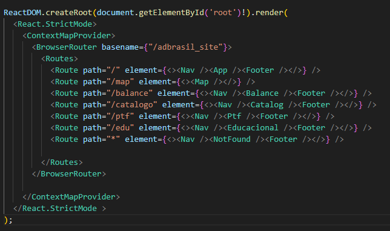

- Scripts para automatização

```bash
#no windows
 .\deploy.bat

#no mac/linux
 npm run deploy

#ou
 source ./deploy.sh
```

> O repositório de produção se encontra em https://github.com/luccve/adbrasil_site

# Stack Site

Plataforma desenvolvida no Node.js LTS.

## React + TypeScript + Vite

This template provides a minimal setup to get React working in Vite with HMR and some ESLint rules.

Currently, two official plugins are available:

- [@vitejs/plugin-react](https://github.com/vitejs/vite-plugin-react/blob/main/packages/plugin-react/README.md) uses [Babel](https://babeljs.io/) for Fast Refresh
- [@vitejs/plugin-react-swc](https://github.com/vitejs/vite-plugin-react-swc) uses [SWC](https://swc.rs/) for Fast Refresh

# Estrutura do projeto do site

O projeto do site conta com os seguintes diretórios.

```
.
├── README.md
├── deploy.bat
├── deploy.sh
├── dist
│   └── adbrasil_site
│       ├── 404.html
│       ├── BalanceLogo.svg
│       ├── Icone.png
│       ├── Icone.svg
│       ├── adpe.json
│       ├── agua.json
│       ├── agua_logo.svg
│       ├── assets
│       ├── background_section_left.svg
│       ├── background_section_right.svg
│       ├── catalogo.svg
│       ├── catalogo_pub-min.jpg
│       ├── google_play.png
│       ├── icon.svg
│       ├── index.html
│       ├── localizacao.svg
│       ├── location.png
│       ├── logo_embrapa.png
│       ├── mockup.png
│       ├── ptf.svg
│       ├── rotas.png
│       ├── rotas_producao.png
│       └── unsplash_fundo.png
├── index.html
├── package-lock.json
├── package.json
├── postcss.config.js
├── public
├── src
│   ├── @types
│   │   ├── components.d.ts
│   │   └── data.d.ts
│   ├── App.css
│   ├── App.tsx
│   ├── assets
│   │   ├── dados_municipios.json
│   │   ├── dados_uf.json
│   │   ├── geoinfo_links.json
│   │   ├── library_add.svg
│   │   └── react.svg
│   ├── components
│   │   ├── GeoJSONMap
│   │   ├── ScrollToHashElement
│   │   ├── SearchClip
│   │   ├── TilerLayersMapControl
│   │   ├── WMSFilter
│   │   ├── WMSTileLayersControl
│   │   ├── btn
│   │   ├── card
│   │   ├── carrousel
│   │   ├── chart
│   │   ├── clearLayers
│   │   ├── footer
│   │   ├── formPTF
│   │   ├── getCoordinates
│   │   ├── getLegendsMaps
│   │   ├── getPosition
│   │   ├── handlePositionMap
│   │   ├── icon
│   │   ├── input
│   │   ├── loading
│   │   ├── mapEvents
│   │   ├── miniMap
│   │   ├── modal
│   │   ├── nav
│   │   ├── navMap
│   │   ├── notFound
│   │   ├── opacitySliderMap
│   │   ├── resultadoPTF
│   │   └── triangleTexture
│   ├── contexts
│   │   └── index.tsx
│   ├── database
│   │   └── data
│   ├── index.css
│   ├── main.tsx
│   ├── pages
│   │   ├── balance
│   │   ├── catalogo
│   │   ├── educacional
│   │   ├── home
│   │   ├── map
│   │   └── ptf
│   ├── ptfFunctions
│   │   └── index.ts
│   ├── services
│   │   └── index.ts
│   ├── themes
│   │   └── colors.ts
│   └── vite-env.d.ts
├── tailwind.config.js
├── tsconfig.json
├── tsconfig.node.json
└── vite.config.ts
```

## A organização:

- App.tsx: Ponto de entrada principal do aplicativo.
- README.md: Documentação do projeto.
- node_modules: Pasta que contém as dependências do projeto.
- package.json: Arquivo de configuração e informações do projeto.
- vite.config.ts: Arquivo de configuração do Vite.
- src: Pasta principal do código-fonte.
  - @types: Definições de tipo personalizadas.
  - assets/: Recursos estáticos, como JSON, imagens e ícones.
  - contexts: Contextos do React para compartilhamento de dados.
  - PtfFunctions: Funções relacionadas ao Ptf.
  - main.tsx: Componente principal do site.
  - components: Componentes reutilizáveis.
  - database: Arquivos relacionados ao informações de catálogo.
  - routes: Definição das rotas de navegação.
  - pages: Telas principais do site.
  - services: Serviços e utilitários do aplicativo.
  - theme: Estilos e configurações de aparência.
- tsconfig.json: Configuração do TypeScript.


# Componentes Site

O desenvolvimento da aplicação é funcional e com separação de responsabilidades (Separation of concerns).

## Btn

Ao todo foi desenvolvido 4 botoes. Que segue o padrao com as cores do site.

### btnLink

- O componente BtnLink é uma abstração para um botão de link personalizado em aplicações React. Ele permite que o usuário clique no botão e seja redirecionado para uma rota específica. Aqui estão os principais pontos sobre esse componente:

#### Propriedades btnLink

<div align='center'>

| Propriedade | Tipo       | Descrição                                            |
| ----------- | ---------- | ---------------------------------------------------- |
| title       | string     | Titulo do botão.                                     |
| path        | string     | Caminho da url do botão.                             |
| children    | JSXElement | Pode anexar uma imagem ao botão passando como filho. |

</div>

### BtnRegular

- O componente BtnRegular é uma abstração para um botão de link personalizado em aplicações React. Ele permite que o usuário clique no botão e seja redirecionado para uma rota específica. Aqui estão os principais pontos sobre esse componente:

#### Propriedades btnRegular

<div align='center'>

| Propriedade | Tipo       | Descrição                                            |
| ----------- | ---------- | ---------------------------------------------------- |
| title       | string     | Titulo do botão.                                     |
| path        | string     | Caminho da url do botão.                             |
| children    | JSXElement | Pode anexar uma imagem ao botão passando como filho. |

</div>

### btnSave

- O componente BtnSave é um componente funcional React chamado BtnSave. Ele recebe duas propriedades (Title e Path) e utiliza o hook useNavigate do React Router DOM para realizar a navegação quando o botão é clicado.

#### Propriedades btnSave

<div align='center'>

| Propriedade | Tipo   | Descrição                                     |
| ----------- | ------ | --------------------------------------------- |
| title       | string | Título do botão.                              |
| path        | string | Caminho da URL para onde o botão redireciona. |

</div>

### BtnToggleArrow

- O componente BtnToggleArrow é um botão de alternância que exibe uma seta para cima ou para baixo, dependendo do estado do pino. Ele é frequentemente usado para mostrar ou ocultar conteúdo quando clicado.

#### Propriedades BtnToggleArrow

<div align='center'>

| Propriedade | Tipo       | Descrição                                          |
| ----------- | ---------- | -------------------------------------------------- |
| pin         | boolean    | Indica o estado do pino (para cima ou para baixo). |
| togglePin   | () => void | Função de callback para alternar o estado do pino. |

</div>

## Card

- O componente Card é responsável por exibir um cartão com um título e um texto associado. Ele também possui uma animação que é ativada quando o cartão se torna visível na tela, dando um efeito visual agradável.

### Propriedade Card

<div align='center'>

| Propriedade | Tipo   | Descrição                  |
| ----------- | ------ | -------------------------- |
| Title       | string | Título do cartão.          |
| Text        | string | Texto associado ao cartão. |

</div>

#### CardList

- O componente CardList é responsável por exibir uma lista de itens em dois painéis, um para os títulos e outro para os resultados. Ele recebe dois arrays de strings como entrada, um para os títulos e outro para os resultados correspondentes.

##### Propriedades Cardlist

<div align='center'>

| Propriedade | Tipo     | Descrição                                                 |
| ----------- | -------- | --------------------------------------------------------- |
| ArrayRes    | string[] | Array contendo os resultados a serem exibidos.            |
| ArrayTitle  | string[] | Array contendo os títulos correspondentes aos resultados. |

</div>

## Carrousel

### CarrouselRegion

- O componente CarrouselRegion exibe uma lista de itens em forma de carrossel, permitindo ao usuário selecionar um item específico. Ele recebe um array de objetos como entrada, cada objeto contendo informações sobre um item na lista.

### Propriedade CarrouselRegion

<div align='center'>

| Propriedade     | Tipo                    | Descrição                                                                                                                        |
| --------------- | ----------------------- | -------------------------------------------------------------------------------------------------------------------------------- |
| Array           | ListaRegionsProps[]     | Array de objetos representando os itens a serem exibidos no carrossel.                                                           |
| onSelect        | (index: number) => void | Função de retorno de chamada a ser executada quando um item for selecionado. Recebe o índice do item selecionado como argumento. |
| title           | string                  | Título opcional a ser exibido acima do carrossel.                                                                                |
| initialPosition | number                  | Índice inicial do item selecionado no carrossel.                                                                                 |

</div>

### CarrouselTabs

- O componente CarrouselTabs exibe uma lista de abas que permitem ao usuário selecionar uma aba específica. Ele recebe um array de objetos como entrada, cada objeto contendo informações sobre uma aba na lista.

#### Propriedade CarrouselTabs

<div align='center'>

| Propriedade | Tipo                    | Descrição                                                                                                                       |
| ----------- | ----------------------- | ------------------------------------------------------------------------------------------------------------------------------- |
| Array       | ListaTabsProps[]        | Array de objetos representando as abas a serem exibidas no carrossel.                                                           |
| onSelect    | (index: number) => void | Função de retorno de chamada a ser executada quando uma aba for selecionada. Recebe o índice da aba selecionada como argumento. |

</div>

## Chart

### ChartBar

- O componente ChartLine exibe um gráfico de linha com pontos de dispersão representando uma curva de retenção de água no solo. Ele utiliza a biblioteca Victory para renderizar o gráfico.

#### Propriedade ChartBar

<div align='center'>

| Propriedade | Tipo   | Descrição                                                    |
| ----------- | ------ | ------------------------------------------------------------ |
| alpha       | number | Parâmetro alpha da curva de retenção de água no solo.        |
| n           | number | Parâmetro n da curva de retenção de água no solo.            |
| theta_r     | number | Umidade residual do solo (theta_r) da curva de retenção.     |
| theta_s     | number | Umidade de saturação do solo (theta_s) da curva de retenção. |

</div>

### ChartLine

- O componente ChartLine exibe um gráfico de linha com pontos de dispersão representando uma curva de retenção de água no solo. Ele utiliza a biblioteca Victory para renderizar o gráfico.

#### Propriedade ChartLine

<div align='center'>

| Propriedade | Tipo   | Descrição                                                    |
| ----------- | ------ | ------------------------------------------------------------ |
| alpha       | number | Parâmetro alpha da curva de retenção de água no solo.        |
| n           | number | Parâmetro n da curva de retenção de água no solo.            |
| theta_r     | number | Umidade residual do solo (theta_r) da curva de retenção.     |
| theta_s     | number | Umidade de saturação do solo (theta_s) da curva de retenção. |

</div>

## ClearLayers

- O componente ClearLayers é responsável por limpar todas as camadas adicionadas ao mapa Leaflet, exceto aquelas que têm a classe 'geonode'. Ele é acionado quando a propriedade `clear` é definida como `true`.

### Propriedades CleanLayers

| Propriedade | Tipo                    | Descrição                                         |
| ----------- | ----------------------- | ------------------------------------------------- |
| clear       | boolean                 | Indica se as camadas devem ser limpas.            |
| setClear    | React.Dispatch<boolean> | Função de atualização para a propriedade `clear`. |

## Footer

- O componente Footer exibe o rodapé de uma página, contendo informações sobre uma empresa ou organização, como seu logotipo, nome, endereço e informações de contato.

## formPTF

- O componente FormPTF é responsável por exibir um formulário para entrada de dados e cálculo de um modelo específico de Predição da Fertilidade do Solo (PTF).

### Propriedade formPTF

- O componente exibe um formulário com campos para entrada de dados relacionados à composição do solo, como percentuais de areia, argila, silte, densidade, pH, entre outros.
- Os usuários podem preencher os campos manualmente ou utilizar a função de teste para preencher automaticamente com valores aleatórios.
- Após preencher os campos e clicar no botão "Calcular", o componente executa o modelo de PTF selecionado com base nos dados inseridos.
- Os resultados do cálculo são exibidos abaixo do formulário, incluindo gráficos e informações específicas sobre o modelo de PTF utilizado.

## GeoJSONMap

- É um componente React chamado GeoJSONMap, que renderiza um GeoJSON em um mapa Leaflet. Ele recebe uma propriedade chamada Opacity, que determina a opacidade do GeoJSON renderizado.

### Propriedade GeoJSONMap

<div align='center'>

| Propriedade | Tipo   | Descrição                                   |
| ----------- | ------ | ------------------------------------------- |
| Opacity     | number | A opacidade do GeoJSON renderizado no mapa. |

</div>

## GetCoordinates

- O componente `GetCoordinates` é responsável por exibir as coordenadas (latitude e longitude) do cursor do mouse em um mapa Leaflet. Ele cria uma div HTML dinamicamente para exibir as coordenadas e adiciona essa div como um controle na parte inferior esquerda do mapa. O componente utiliza os hooks `useMap` e `useEffect` para acessar o mapa Leaflet e atualizar as coordenadas conforme o movimento do cursor do mouse. Ele também utiliza o hook `useRef` para manter uma referência à div HTML onde as coordenadas são exibidas.

### Propriedade GetCoordinates

<div align='center'>

| Propriedade | Tipo            | Descrição                                                      |
| ----------- | --------------- | -------------------------------------------------------------- |
| map         | React.RefObject | Referência ao mapa Leaflet onde as coordenadas serão exibidas. |
| infoRef     | React.RefObject | Referência à div HTML onde as coordenadas serão exibidas.      |

</div>

## getLegendsMaps

- O componente `GetLegendsMaps` é responsável por exibir as legendas relacionadas a diferentes camadas de um mapa. Ele recebe a propriedade `layer`, que indica a camada para a qual a legenda está sendo exibida. Com base nessa propriedade, o componente decide qual legenda deve ser renderizada.

- O componente utiliza os ícones `BiSolidFoodMenu` e `MdMenuBook` para permitir ao usuário alternar entre os modos de exibição de legenda e menu. Ele também utiliza estados locais para controlar a posição da legenda, o estado de arrastar, a escala, a exibição do ícone e a posição inicial ao arrastar.

### Propriedade getLegendsMaps

Existem três tipos de legendas renderizadas pelo componente:

1. **Solos do Brasil:** Exibe as legendas dos diferentes tipos de solo no Brasil.
2. **Potencial de terras para irrigação (EMBRAPA):** Exibe as legendas relacionadas ao potencial de terras para irrigação.
3. **Outras camadas:** Exibe as legendas de outras camadas, como Biomas do Brasil (IBGE) e ZONPB AD (EMBRAPA).

Cada tipo de legenda é renderizado de acordo com sua estrutura e estilo específicos, incluindo cores, textos e escalas.

## getPosition

- O componente `GetPosition` é responsável por permitir que o usuário encontre sua geolocalização e centralize o mapa nessa posição. Ele exibe um ícone de localização no canto superior esquerdo do mapa, que o usuário pode clicar para ativar a função de geolocalização.

- O componente utiliza o hook `useMap` do React Leaflet para acessar a instância do mapa. Além disso, utiliza o hook `useEffect` para garantir que o código de inicialização seja executado apenas uma vez, quando o mapa estiver pronto.

- Quando o ícone de localização é clicado, o componente tenta obter a posição do usuário utilizando a API de geolocalização do navegador. Se for bem-sucedido, centraliza o mapa na posição do usuário e adiciona um marcador nessa posição com um ícone personalizado. Caso contrário, exibe uma mensagem de erro no console.

- O ícone de localização é renderizado usando o componente `MdPlace` do React Icons, e seu estilo é definido inline para controlar tamanho e cor.

- O componente `GetPosition` é adicionado como um controle personalizado ao mapa usando a classe `L.Control.extend`. O ícone de localização é adicionado como conteúdo HTML dentro desse controle, e um evento de clique é adicionado para acionar a função de geolocalização.

### Propriedade getPosition

| Propriedade | Tipo      | Descrição                                                  |
| ----------- | --------- | ---------------------------------------------------------- |
| map         | React.Map | Referência ao mapa Leaflet onde a posição será manipulada. |
| iconRef     | React.Ref | Referência à div HTML que contém o ícone de localização.   |

## handlePositionMap

- O componente `HandlePositionMap` é responsável por permitir que o usuário selecione uma posição no mapa clicando com o mouse. Quando o usuário clica em um local do mapa, um marcador é exibido nessa posição.

- Ele utiliza o hook `useMapEvents` do React Leaflet para adicionar um ouvinte de eventos ao mapa. Quando ocorre um evento de clique no mapa, a posição (latitude e longitude) do clique é capturada e armazenada no estado interno do componente.

- Se o prop `close` for `true`, indicando que o componente deve ser fechado, a posição é limpa (definida como `null`). Caso contrário, se o prop `close` for `false`, a posição é atualizada com as coordenadas do clique.

- O componente retorna um marcador (`Marker`) com a posição selecionada, se houver uma posição definida e o prop `close` for `false`. Se o prop `close` for `true`, indicando que o componente deve ser fechado, o marcador não é renderizado.

### Propriedade handlePositionMap

| Propriedade | Tipo    | Descrição                                                    |
| ----------- | ------- | ------------------------------------------------------------ |
| close       | boolean | Indica se o componente deve limpar a posição ao ser fechado. |

## icon

- O objeto `Icon` é uma instância da classe `DivIcon` do Leaflet, utilizada para criar ícones personalizados para os marcadores no mapa. Ele é composto por três propriedades principais:

1. `html`: Representa o conteúdo HTML do ícone. Neste caso, é utilizado o método `renderToString` do `react-dom/server` para renderizar o componente `TiLocation` do pacote `react-icons` em uma string HTML.

2. `iconAnchor`: Define as coordenadas do ícone em relação ao seu ponto de referência. Este ponto é usado para posicionar o ícone no mapa. No exemplo, `[18, 20]` indica as coordenadas X e Y do ícone.

3. `className`: Permite adicionar classes CSS adicionais ao ícone. No exemplo, a classe `marker` é adicionada para aplicar estilos específicos ao ícone.

- Este ícone personalizado é utilizado para representar os marcadores no mapa, permitindo a customização do seu visual de acordo com as necessidades do aplicativo.

### Propriedade icon

| Propriedade | Tipo     | Descrição                                                   |
| ----------- | -------- | ----------------------------------------------------------- |
| html        | string   | HTML que representa o ícone.                                |
| iconAnchor  | number[] | Coordenadas do ícone em relação ao seu ponto de referência. |
| className   | string   | Classes CSS adicionais para o ícone.                        |

## input

### inputText

O componente `InputText` é um componente funcional que representa um campo de entrada de texto em um formulário. Ele possui as seguintes propriedades:

- `Title`: Título do campo de entrada, utilizado como rótulo associado ao campo.
- `handleFocus`: Função chamada quando o campo de entrada recebe foco.
- `handleBlur`: Função chamada quando o campo de entrada perde o foco.
- `handleTextChange`: Função chamada quando o texto no campo de entrada é alterado.
- `state`: Estado relacionado ao campo de entrada. Pode ser qualquer tipo de dado.
- `value`: Valor atual do campo de entrada.

O componente renderiza um campo de entrada `<input>` HTML, juntamente com o rótulo associado a ele. As classes CSS são aplicadas para estilizar o componente de acordo com o design específico do aplicativo. Quando o valor do campo é alterado, a função `handleTextChange` é chamada para atualizar o estado relacionado ao campo de entrada.

#### Propriedade inputText

| Propriedade      | Tipo     | Descrição                                                     |
| ---------------- | -------- | ------------------------------------------------------------- |
| Title            | string   | Título do campo de entrada.                                   |
| handleFocus      | function | Função chamada quando o campo de entrada recebe foco.         |
| handleBlur       | function | Função chamada quando o campo de entrada perde o foco.        |
| handleTextChange | function | Função chamada quando o texto no campo de entrada é alterado. |
| state            | any      | Estado relacionado ao campo de entrada.                       |
| value            | string   | Valor atual do campo de entrada.                              |

### Select

O componente `Select` é responsável por renderizar um menu suspenso de seleção de opções. Ele recebe as seguintes propriedades:

- `array`: Array de opções para o menu suspenso.
- `inputTitle`: Título do campo de seleção.
- `onSelect`: Função chamada quando uma opção é selecionada. Recebe o texto da opção como argumento.
- `onValue`: Função chamada quando o valor do campo de seleção é alterado. Recebe o valor da opção como argumento.
- `onClick`: Função chamada quando ocorre um clique no menu suspenso.

O componente renderiza um elemento `<select>` HTML com as opções fornecidas pelo array. Quando uma opção é selecionada, as funções `onSelect` e `onValue` são chamadas para atualizar os valores relacionados ao campo de seleção. A função `onClick` é chamada quando ocorre um clique no menu suspenso.

#### Propriedade Select

| Propriedade | Tipo     | Descrição                                                     |
| ----------- | -------- | ------------------------------------------------------------- |
| array       | any[]    | Array de opções para o menu suspenso.                         |
| inputTitle  | string   | Título do campo de seleção.                                   |
| onSelect    | function | Função chamada quando uma opção é selecionada.                |
| onValue     | function | Função chamada quando o valor do campo de seleção é alterado. |
| onClick     | function | Função chamada quando ocorre um clique no menu suspenso.      |

### SelectText

O componente `SelectText` renderiza um menu suspenso de seleção de opções com base nos valores fornecidos através da propriedade `Valores`. Ele recebe as seguintes propriedades:

- `Valores`: Um array de objetos do tipo `perfis[]`, contendo as opções do menu suspenso.
- `SelectName`: Uma função de atualização do estado que armazena o valor selecionado no menu suspenso.
- `onClick`: Uma função chamada quando ocorre um clique no menu suspenso.

Quando uma opção é selecionada no menu suspenso, a função `onClick` é chamada e, em seguida, a função `SelectName` é chamada para atualizar o estado com o valor selecionado. O menu suspenso é renderizado com as opções fornecidas pelo array `Valores`.

#### Propriedade SelectText

| Propriedade | Tipo                                      | Descrição                                                                          |
| ----------- | ----------------------------------------- | ---------------------------------------------------------------------------------- |
| Valores     | perfis[]                                  | Array de objetos contendo os valores e chaves das opções do menu suspenso.         |
| SelectName  | React.Dispatch<React.SetStateAction<any>> | Função de atualização do estado que armazena o valor selecionado no menu suspenso. |
| onClick     | () => void                                | Função chamada quando ocorre um clique no menu suspenso.                           |

## loading

- O componente que renderiza um SVG que representa o carregamento, ele retornar um JSX, geralmente utilizado em componentes funcionais assíncronos.

## mapEvents

- O componente funcional `MapEvents` é responsável por lidar com os eventos do mapa utilizando a biblioteca `react-leaflet`. Ele captura eventos como cliques no mapa e mudanças de camada para realizar ações específicas, como buscar coordenadas, atualizar o contexto do mapa e controlar as camadas exibidas.

- Este componente utiliza as propriedades `setLoading` e `setLayer` para atualizar o estado de carregamento e a camada exibida no mapa, respectivamente. Essas funções são passadas como argumentos para o componente e são chamadas em diferentes eventos do mapa para realizar ações específicas, como buscar coordenadas ao clicar no mapa e alterar a camada exibida ao adicionar uma nova camada.

### Propriedade mapEvents

<div align="center">

| Propriedade | Tipo     | Descrição                                                   |
| ----------- | -------- | ----------------------------------------------------------- |
| setLoading  | function | Função para definir o estado de carregamento do componente. |
| setLayer    | function | Função para definir a camada atual exibida no mapa.         |

</div>

## miniMap

- Este componente React em TypeScript, MinimapControl, é responsável por exibir um minimapa em um canto específico do mapa principal. Ele utiliza a biblioteca react-leaflet para renderizar o minimapa e controlar seus eventos. O minimapa é uma versão reduzida do mapa principal e permite uma visão geral da área abrangida pelo mapa principal. O minimapa é composto por um MapContainer contendo um TileLayer para exibir o mapa base e um componente MinimapBounds para delimitar a área exibida no minimapa. O minimapa é inserido em um contêiner com a classe CSS correspondente à posição especificada.
-

### Propriedade miniMap

<div align="center">
| Propriedade | Tipo   | Descrição                                         |
| ----------- | ------ | ------------------------------------------------- |
| position    | string | Posição do minimapa em relação ao mapa principal. |
| zoom        | number | Nível de zoom inicial do minimapa.                |
</div>

## modal

### ModalAlert

- O componente ModalAlert é utilizado para exibir mensagens em um modal.

#### Propriedade modalAlert

| Propriedade | Tipo                               | Descrição                                                          |
| ----------- | ---------------------------------- | ------------------------------------------------------------------ |
| message     | string \| Record\<string, string\> | Mensagem a ser exibida no modal. Pode ser uma string ou um objeto. |
| title       | string                             | Título do modal. Opcional.                                         |
| visible     | boolean                            | Indica se o modal deve ser exibido.                                |
| onClose     | Function                           | Função de callback para fechar o modal.                            |

### ModalComponente

- Este componente é um modal que permite ao usuário inserir valores de latitude e longitude. Ele exibe campos de entrada para latitude e longitude, permitindo que o usuário insira valores e realize uma ação ao clicar em um botão de pesquisa.

#### Propriedade ModalComponente

| Propriedade | Tipo                     | Descrição                                                                                 |
| ----------- | ------------------------ | ----------------------------------------------------------------------------------------- |
| title       | string                   | Título do modal. Opcional.                                                                |
| onClose     | Function                 | Função de callback para fechar o modal. Recebe um booleano como parâmetro.                |
| latLong     | Function                 | Função para atualizar a latitude e longitude. Recebe uma expressão LatLng como parâmetro. |
| coords      | LatLngExpression \| null | Coordenadas de latitude e longitude.                                                      |

### ModalMap

- Este componente é um modalMap que exibe informações sobre unidades de mapeamento e seus componentes. Ele permite alternar entre a exibição das informações da unidade e dos componentes. O modal pode ser minimizado ou fechado pelo usuário.

#### Propriedade ModalMap

| Propriedade | Tipo     | Descrição                                                                  |
| ----------- | -------- | -------------------------------------------------------------------------- |
| onClose     | Function | Função de callback para fechar o modal. Recebe um booleano como parâmetro. |
| visible     | boolean  | Indica se o modal está visível ou não.                                     |

### ModalSearch

- Este componente é um modal de busca que permite ao usuário selecionar um filtro entre diferentes opções, como limite federativo, limite municipal ou filtro personalizado. Ele também fornece opções para limpar o filtro selecionado, cancelar a operação ou confirmar a busca.

#### Propriedade ModalSearch

| Propriedade | Tipo     | Descrição                                                                               |
| ----------- | -------- | --------------------------------------------------------------------------------------- |
| close       | boolean  | Indica se o modal está aberto ou fechado.                                               |
| onClose     | Function | Função de callback para fechar o modal. Recebe um booleano como parâmetro.              |
| onValue     | Function | Função de callback para retornar o valor selecionado. Recebe uma string como parâmetro. |
| handleClear | Function | Função de callback para limpar o filtro selecionado. Recebe um booleano como parâmetro. |

## nav

- Elemento JSX resnponsavel pelo navBar do site, se comportar de forma responsiva.

## navMap

- Elemento JSX resnponsavel pelo navBar da página do Mapa.

## notFound

- Elemento JSX responsável por páginas não existentes. Se comportar de forma responsiva.

## opacitySliderMap

- Este componente é um slider de opacidade que permite ao usuário ajustar a opacidade de algum elemento. Ele exibe o valor atual da opacidade e fornece um controle deslizante para ajustá-lo.

### Propriedades opacitySliderMap

| Propriedade | Tipo              | Descrição                                                                       |
| ----------- | ----------------- | ------------------------------------------------------------------------------- |
| setOpacity  | (opacity: number) | Função de callback para atualizar a opacidade. Recebe um número como parâmetro. |

## resultadoPTF

Este componente exibe os resultados de um modelo de ponto de tensão (PTF), incluindo informações sobre o autor, os parâmetros do modelo, uma curva de retenção de água no solo e a opção de exportar essa curva como um arquivo CSV.

### Propriedades resultadoPTF

| Propriedade | Tipo   | Descrição                                                                                       |
| ----------- | ------ | ----------------------------------------------------------------------------------------------- |
| ptf         | any[]  | Array contendo os parâmetros do modelo PTF ou resultados, como alpha, n, theta_r, theta_s, etc. |
| author      | string | Nome do autor do modelo PTF.                                                                    |
| cc          | string | Capacidade de campo (CC) do solo.                                                               |
| unidade     | string | Unidade dos parâmetros do modelo PTF.                                                           |
| parametros  | string | Descrição dos parâmetros do modelo PTF.                                                         |
| url         | string | URL para o trabalho de referência do autor.                                                     |
| curva       | string | Tipo de curva (opcional)                                                                        |

## ScrollToHashElemtn

- Este componente é responsável por rolar a página para o elemento associado ao hash na URL quando a página é carregada ou a URL muda.

### Propriedades ScrollToHashElemtn

1. Utiliza o hook useLocation do react-router-dom para obter a localização atual da página.
2. Usa o hook useMemo para memoizar o elemento associado ao hash na URL.
3. Usa o hook useEffect para rolar a página para o elemento associado ao hash quando o hashElement é atualizado.

## searchClip

Este componente é responsável por exibir um controle no mapa Leaflet que permite ao usuário aplicar um filtro de consulta e atualizar a camada WMS exibida no mapa.

### Propriedades searchClip

| Propriedade | Tipo                 | Descrição                                                                                                |
| ----------- | -------------------- | -------------------------------------------------------------------------------------------------------- |
| onClose     | React.Dispatch<bool> | Função de callback para fechar o componente quando ativada.                                              |
| valueWMSMap | string \| null       | Valor que indica a camada WMS a ser exibida no mapa. Pode ser um identificador de município ou sigla UF. |
| opacity     | number               | Opacidade da camada WMS no mapa.                                                                         |

## TilerLayersMapControl

- Este componente é responsável por renderizar um controle de camadas de mapa utilizando a biblioteca Leaflet no contexto do React. Ele permite ao usuário alternar entre diferentes camadas de mapa, como OpenStreetMap, Nat Geo Relevo, Google Satellite, Google Maps e Google Roads.

## WMSFilter

- Este componente é responsável por renderizar uma camada de filtro WMS (Web Map Service) em um mapa Leaflet no contexto do React. Ele recebe informações sobre o filtro WMS, como campo, operador, valor e camada a ser filtrada, e renderiza a camada de acordo com esses parâmetros.

### Propriedades WMSFilter

| Propriedade | Tipo                   | Descrição                                 |
| ----------- | ---------------------- | ----------------------------------------- |
| Opacity     | number                 | Define a opacidade da camada WMS.         |
| setLayer    | React.Dispatch<string> | Função para definir o nome da camada WMS. |

## WMSTilerLayersControl

Este componente é responsável por renderizar um controle de camadas WMS (Web Map Service) em um mapa Leaflet no contexto do React. Ele permite ao usuário adicionar ou remover camadas WMS ao mapa e controlar a opacidade dessas camadas.

### Propriedades WMSTilerLayersControl

| Propriedade | Tipo   | Descrição                           |
| ----------- | ------ | ----------------------------------- |
| Opacity     | number | Define a opacidade das camadas WMS. |


# Pages do site

## balance

- Página não foi desenvolvida, a proposta é utilizar pedotransferência utilizando técnicas de inteligência artificial.

## catalogo

- Página destinada a mostrar a tabela do catalogo do boletim técnico 282 de forma dinâmica ao usuário. O usuário poderá fazer filtros e selecionar a textura ou até mesmo a classe de solo.
  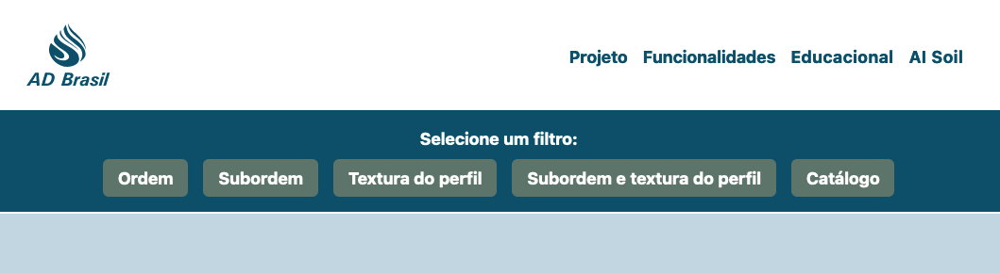

- O usuário poderá ir diretamente para o boletim caso acesso o filtro de Catálogo e clique duas vezes na imagem.

## educacional

- Página não foi desenvolvida, a proposta é elucidar os principais conceitos sobre o tema de água Disponível no solo.

## home

- Página da home page do site.
  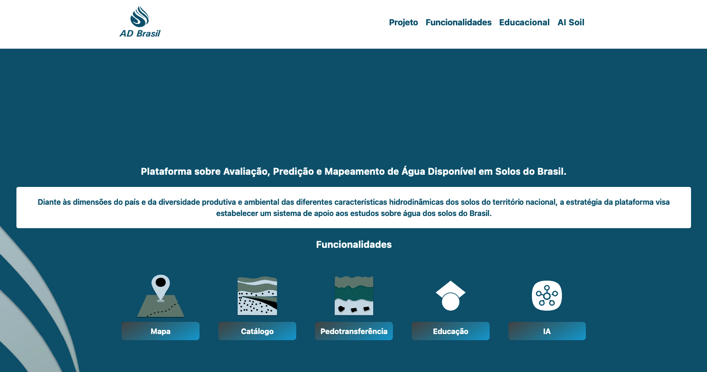

## map

- Página que contém acesso aos 29 mapas de água disponíveis, o usuário poderá criar filtros por estado e munícipio. O site se comporta de maneira transparente para que o usuario se informe sempre com mapas de melhores escalas dependendo da região selecionada.

### Descrição do mapa site

<div align="center">
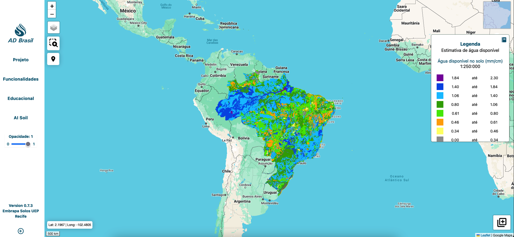
</div>
<br>
Essa tela conta com 6 funcionalidades.

<div align="center">

| Funcionalidades      | Descrição                                            | Ícones                                |
| -------------------- | ---------------------------------------------------- | ------------------------------------- |
| Limpar               | Limpa na tela marcadores ou polígonos selecionados   | 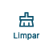     |
| Mudar camada do mapa | Troca para camada satélite ou hibrida do google maps | 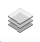    |
| Filtro               | Buscar por filtro                                    |     |
| Opacidade            | Opacidade dos mapas renderizados                     | 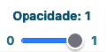        |
| Água disponível      | Selecionar camadas de água disponível                | 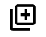 |
| Posição              | Buscar informação de coordenada do usuário           |     |

</div>

> Além dessas funcionalidades o mapa conta com eventos de click do mouse que resgata informações do mapa referentes à água disponível.

## ptf

- Página que reúne equações de pedotransferência, adequado para usuários que queiram estimar água disponivel de solos a partir de dados mais acessiveis como a granulometria. Nesta págia a funcionlaidades para exportar a curva de retenção e visualizar o comportamento hídrico do solo a partir de um gráfico.

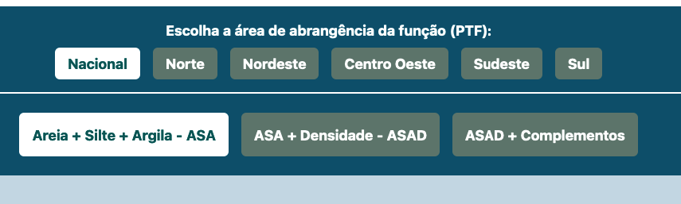

- Para funcionamento é necessário selecionar a região e o tipo de PTF. Se caso houver PTF para este filtro será mostrada encadeada se houver mais de uma. Para preencher as informações é precisos selecionar a que tem interesse utilizar.
  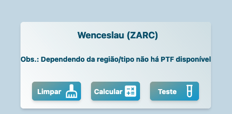
- Há PTFs que detém a capacidade de estimar além do ponto a curva de retenção hídrica.
- Diante desta possibilidade há opção de exportar a curva em formato CSV.

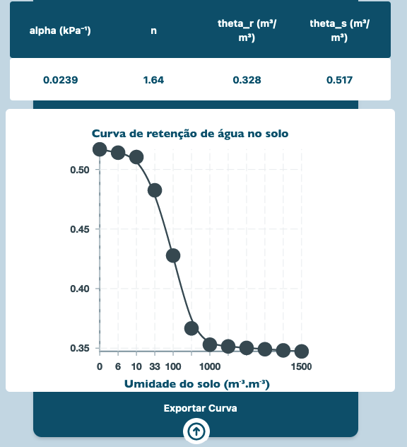

# Bibliotecas instaladas no site

A proposta é o desenvolvimento com baixa dependência, para favorecer o tempo de vida da aplicação e baixa manutenção. E focada em bibliotecas atualizadas constantemente e com baixo risco de obsolescência.

## Tailwind

O Tailwind CSS é uma biblioteca de classes utilitárias para estilização de interfaces web. Ele oferece uma abordagem funcional para o design, permitindo que você crie estilos rapidamente sem escrever CSS personalizado. Aqui estão alguns pontos-chave sobre o Tailwind:

- Classes Utilitárias: O Tailwind fornece uma ampla variedade de classes que você pode aplicar diretamente aos elementos HTML. Por exemplo, bg-blue-500 define o fundo como azul.

- Configurável: Você pode personalizar o Tailwind para atender às suas necessidades, definindo cores, espaçamentos, fontes e muito mais no arquivo de configuração.

- Responsivo: O Tailwind facilita a criação de layouts responsivos com classes como md:flex (aplicada apenas em telas médias e maiores).
  Composição: Você pode combinar várias classes para criar estilos complexos. Por exemplo, class="bg-blue-500 text-white font-bold".

## Leaflet

O React Leaflet é uma biblioteca utilizada para criação de mapas e representação de feições do espaço geográfico em aplicações React. Aqui estão os principais pontos sobre o React Leaflet:

- Integração com o Leaflet: O React Leaflet é uma camada de abstração sobre a biblioteca Leaflet, que é amplamente utilizada para mapas interativos na web.

- Componentes Reutilizáveis: O React Leaflet fornece componentes React que facilitam a criação de mapas, marcadores, popups e outras funcionalidades geoespaciais.

- Configuração Personalizada: Você pode personalizar o comportamento do mapa, definindo opções como centro, zoom, camadas de tile, etc.

## React Router Dom

O React Router Dom é uma biblioteca popular para gerenciamento de rotas em aplicações React. Ele permite criar navegação dinâmica entre diferentes páginas ou componentes, tornando a experiência do usuário mais fluida. Aqui estão os principais pontos sobre o React Router Dom:

- Integração com o React: O React Router Dom é uma extensão do React que facilita a criação de rotas e a navegação entre diferentes partes da aplicação.

- Componentes de Roteamento: A biblioteca fornece componentes como BrowserRouter, Route, Link e Switch para criar e configurar rotas.

- Gerenciamento de Histórico: O React Router Dom mantém um histórico de navegação, permitindo que o usuário volte ou avance entre as páginas.

## Victory Chart

O Victory Chart é uma biblioteca utilizada para criar gráficos e visualizações de dados em aplicações React. Ele oferece uma variedade de componentes para representar dados de forma clara e interativa. Aqui estão os principais pontos sobre o Victory Chart:

- Integração com o React: O Victory Chart é projetado especificamente para funcionar bem com o React, permitindo que você crie gráficos dinâmicos em suas aplicações.

- Componentes Personalizáveis: A biblioteca fornece componentes como VictoryLine, VictoryBar, VictoryPie e muito mais. Esses componentes podem ser personalizados com propriedades para controlar cores, escalas, rótulos e outros detalhes visuais.

- Suporte a Diferentes Tipos de Gráficos: O Victory Chart suporta vários tipos de gráficos, incluindo gráficos de linha, barras, pizza, dispersão e muito mais.

## React Icons

O React Icons é uma biblioteca amplamente utilizada para adicionar ícones a aplicações React. Ele reúne uma variedade de ícones famosos em um só lugar, facilitando a incorporação de elementos visuais em seu projeto. Aqui estão os principais pontos sobre o React Icons:

- Integração com o React: O React Icons foi projetado para funcionar perfeitamente com o React e outros frameworks baseados nele.

- Componentes Personalizáveis: A biblioteca oferece componentes React para cada ícone, permitindo que você os utilize como qualquer outro componente. Você pode personalizar esses ícones com propriedades para controlar tamanho, cor e estilo.

- Ampla Variedade de Ícones: O React Icons inclui ícones populares de várias fontes, como Font Awesome, Material Icons, Feather Icons e muito mais.

